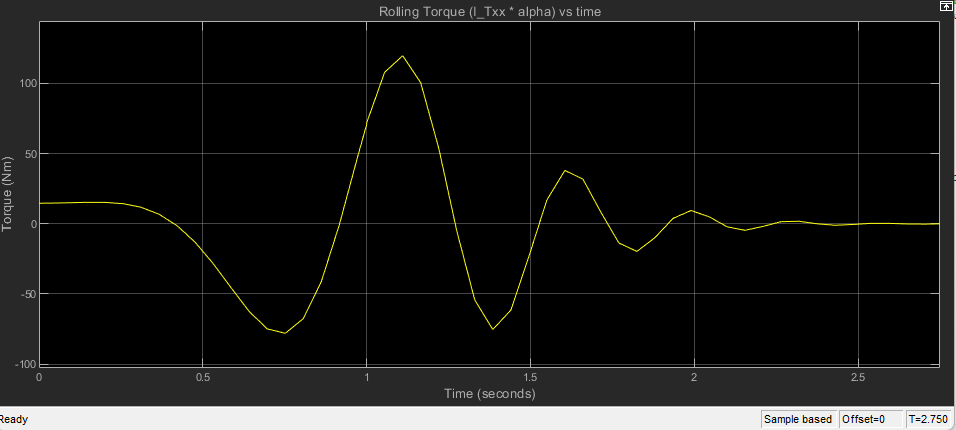
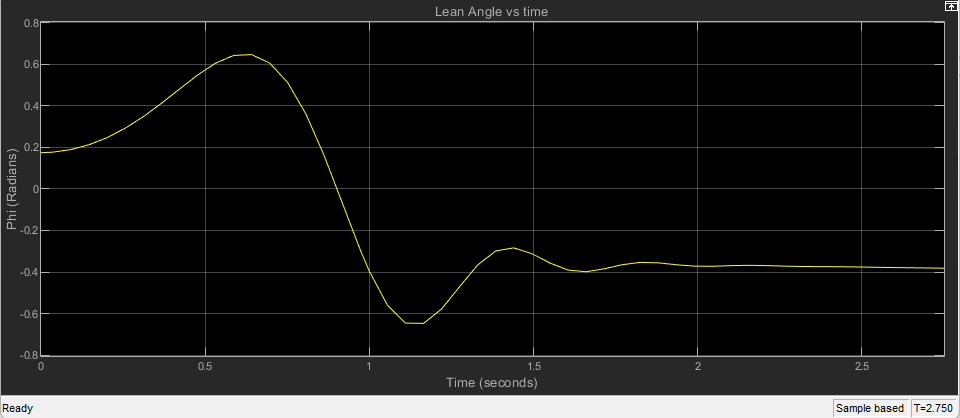

# Bicycle-Dynamics-Project

## Table of Contents

- [Description](#Description)
- [Software](#Software)
- [How to Use](#How-to-Use)
- [Example](#Example)

# Description

This project is surrounded by my fascination of bicycle dynamics. I am deeply interested in the dynamics presented by J. P. Meijaard1, Jim M. Papadopoulos, Andy Ruina and A. L. Schwab in "Linearized dynamics equations for the balance and steer of a bicycle: a benchmark and review". This project takes the rolling and steering torque dynamics presented by this paper and represents them in a Simulink Block Diagram. The user can input any initial conditions of roll or steer angle or angular rate and an output response will be displayed after compiling.

# Software

MATLAB/Simulink

# How-to-Use

First, input all necessary inputs in the Bikebot_1 file. Note that the bicycle is split into 4 main subsystems: rear wheel R, rear frame B (this is the body of the bicycle excluding the front fork and handlebar), front frame H (this is the front fork and handlebar), and front wheel F. Not that subassembly A is comprised of both H and F assemblies. T represents the bicycle as a whole.

The following parameters must be implemented. Changing these parameters would result in different dynamic behaviors.

```MATLAB
% basic geometric parameters
c = 0.0448; %orthogonal distance from steer axis to front wheel contact to ground, Q
w = 0.96468; %wheel span
lambda = pi/10; %camber angle (radians)

%mass of four rigid bodies
m_R = 3.405; %rear wheel mass
m_B = 17.71; %rear frame mass
m_H = 1.61; %front frame mass
m_F = 3.405; %front wheel mass

%COM_x distance of both frames
x_B = 0.4521963; %rear frame COM_x 
x_H = 0.865528645; %front frame COM_x

%radius of wheels
r_R = 0.254; %rear wheel radius
r_F = 0.254; %front wheel radius

%COM_z distance of both frames
z_B = -0.371334; %rear frame COM_z
z_H = -0.32045; %front frame COM_z

%MOIs and POIs
I_Rxx = 0.0603; 
I_Bxx = 1.01; 
I_Hxx = 0.01;  
I_Fxx = 0.0603; 
I_Bxz = 0;  
I_Hxz = 0; 
I_Ryy = 2*I_Rxx;
I_Fyy = 2*I_Fxx;
I_Rzz = I_Rxx;
I_Bzz = 0.57;  
I_Hzz = 0.01; 
I_Fzz = I_Fxx;
```
It is important to note that finding the Mass Moment of Inertia (MOI) Product Moment of Inertia (POI), and other inertial mass properties is done through a CAD software. I modeled my bicycle by first measuring the length and thickness of each component, and recreating it on SOLDIWORKS. I also included the material that each component was made of. Then, I clicked on the "mass properties" feature and I was able to determine the MOI and POI of each assembly. Below is a display of the SOLIDWORKS mass properties feature.


Once all the parameters are defined, compile the code. Now, open the Simulink model. Provide initial conditions to each respective integrator. Providing initial conditions for Integrator and Integrator1 will alter the initial rolling angle rate and steering angle rate, respectively. Providing initial conditions for Integrator3 and Integrator2 will alter the initial rolling angle and steering angle, respectively. All initial conditions must be input in radians. Compile the Simulink diagram and click on each plot moniter and observe the response.

The response displayed in each plot moniter is the torque required to actuate the bicycle back to its equilibrium position over a given amount of time, as well as the steering and rolling angles over a given amount of time. These models can be used to get an understanding of required torque inputs by a human or control system to actuate the bicycle back to a desired position on flat terrains.

# Example

The following response is computed using the parameters already written in the code. The initial conditions for this specific response is:

φ (rolling angle) = 10 degrees, or 0.174533 radians, 
dφ/dt (rollong angular rate) = 0 radians, 
δ (steering angle) = 0 radians, 
dδ/dt (steering angular rate) = 5 degrees per second or 0.0873 radians per second

Rolling torque vs time



Roll angle vs time



Steering torque vs time


steering angle vs time


